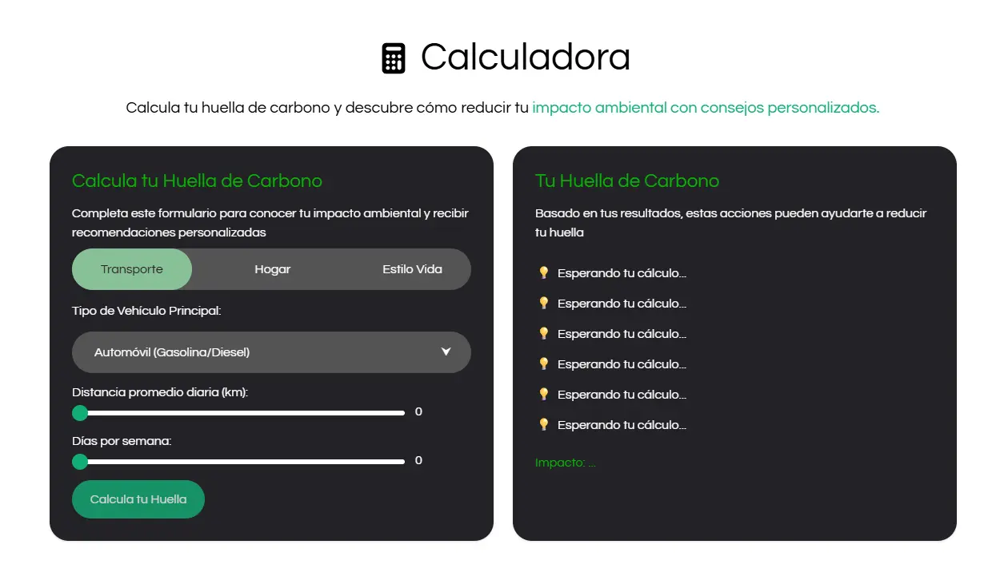

# EcoVida

Bienvenido al repositorio de **EcoVida**, un sitio web para ayudar a los usuarios a calcular su huella de carbono y proporcionar recomendaciones personalizadas para reducir su impacto ambiental.



## Descripción

EcoVida es una herramienta interactiva que permite a los usuarios calcular su huella de carbono de manera sencilla y rápida. Proporciona recomendaciones personalizadas basadas en los hábitos de transporte, consumo energético y estilo de vida, ayudando a reducir el impacto ambiental y fomentar prácticas sostenibles. Este proyecto busca concienciar sobre la importancia de adoptar medidas ecológicas para proteger el medio ambiente y combatir el cambio climático.

## Estructura del Proyecto

El proyecto está organizado de la siguiente manera:

- **`public/`**: Carpeta con los archivos públicos listos para producción
  - **`css/`**: 
    - `output.css`: Archivo CSS compilado y optimizado
  - **`fonts/`**: Fuentes utilizadas  
  - **`img/`**: Carpeta que contiene imágenes misceláneas, favicon.ico y sprites.svg
    - `misc/`: Imágenes misceláneas
  - **`js/`**: 
    - `script.min.js`: Versión minificada del script principal
  - **`index.html`**: Archivo principal que contiene la estructura HTML de la aplicación
  - **`robots.txt`**: Archivo para configurar el comportamiento de los motores de búsqueda
  - **`security.txt`**: Archivo para reportar problemas de seguridad
  - **`sitemap.xml`**: Archivo para facilitar la indexación del sitio por los motores de búsqueda
  - **`video.webm`**: Video de fondo utilizado en la página principal

- **`src/`**: Carpeta con archivos fuente para desarrollo
  - **`css/`**:
    - `input.css`: Archivo con los estilos base usando Tailwind
  - **`js/`**: 
    - `script.js`: Archivo con la lógica principal de la calculadora

- **`.gitignore`**: Configuración de archivos ignorados por Git
- **`CONTRIBUTING.md`**: Guía para contribuir al proyecto
- **`LICENSE`**: Archivo que especifica la licencia MIT del proyecto
- **`package.json`**: Configuración de dependencias y scripts de npm
- **`README.md`**: Documentación principal del proyecto

## Instalación

1. Clona el repositorio:
   ```sh
   git clone https://github.com/cristhian-sdp/EcoVida.git

2. Navega al directorio del proyecto:
    ```sh
   cd EcoVida

## Contribución

Si deseas contribuir a este proyecto, por favor lee nuestras [Guías de Contribución](./CONTRIBUTING.md) para obtener información detallada sobre el proceso de envío de cambios.

## Licencia

Este proyecto está licenciado bajo la Licencia MIT. Esto significa que puedes usar, modificar y distribuir el código bajo los términos de esta licencia.

Para más detalles, consulta el archivo [LICENSE](./LICENSE)

## Contacto

Para cualquier consulta o sugerencia, por favor contacta a través de [steffanod948@gmail.com](mailto:steffanod948@gmail.com).

## Seguridad

Si encuentras alguna vulnerabilidad de seguridad, consulta nuestro [archivo de seguridad](public/security.txt) para conocer el proceso adecuado para reportarla.

© 2025 EcoVida. Todos los derechos reservados.
